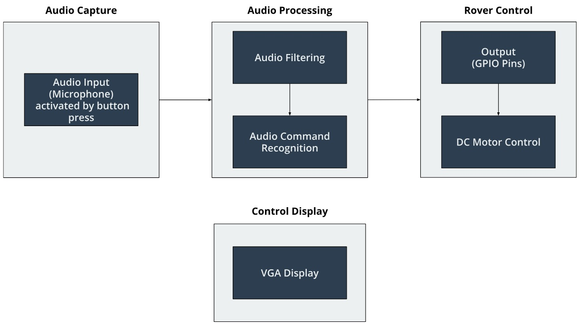

# De1-SoC Voice Controlled Rover

## Project Description
This project integrates voice command recognition with the DE1-SoC FPGA board to control a physical car. Using a microphone, the system captures audio commands in the form of beeps, which are mapped to specific actions. The audio signals undergo processing through various signal analysis techniques, including DC offset removal, normalization, envelope calculation, and a moving average filter to accurately count beeps. These processed commands are then used to drive the car’s motors, enabling actions such as starting, stopping, and turning left and right. The VGA screen displays command prompts, while LED0 indicates active recording. This project showcases real-time signal processing and hardware interaction, utilizing embedded systems for hands-free vehicle control.

## Operating Instructions
Upon compiling and loading the code onto the DE1-SoC board, command prompts will appear on the VGA screen. After connecting the microphone to the board and the physical car to the GPIO pins, press any button to capture audio as you say a command. The system will record for 1.5 seconds, indicated by LED0 lighting up during recording. It recognizes three distinct commands: beep, beep beep, and beep beep beep, each activating the car's motors to perform a specific action—such as starting, stopping, or turning left or right. 

## Block Diagram

